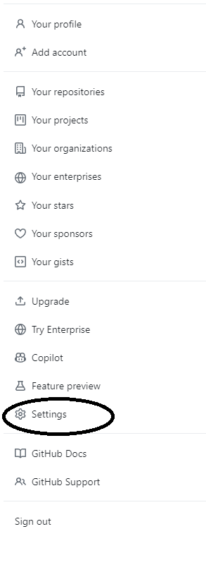
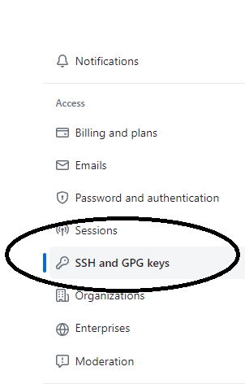
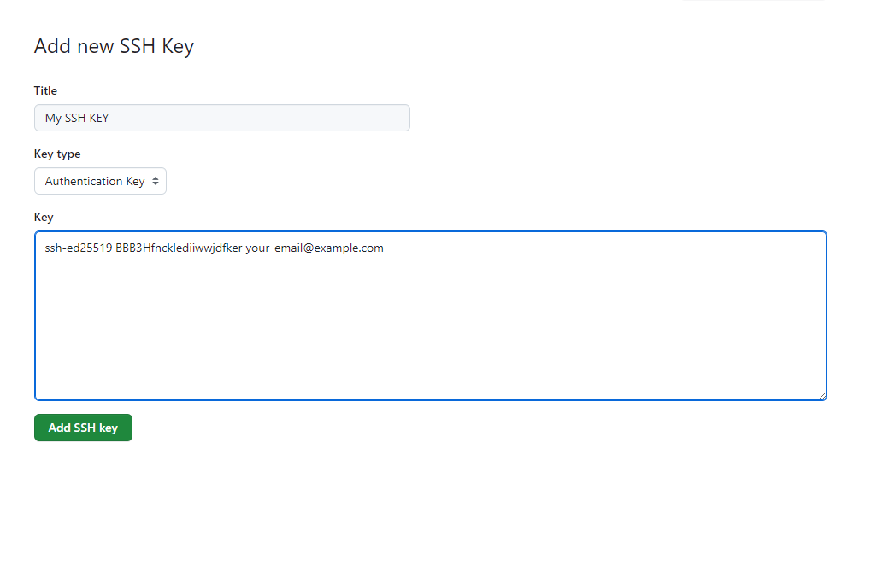

<h1 align="center"> Basic Tutorials of Git </h1>

# Content

1. [Project Status](#projectstatus)
2. [About the Project](#abouttheproject)
3. [Project Description](#projectdescription)
4. [Chapter 1: Basic Useful Commands](#chapter1)
    - [Chapter 1 - Part 1: Create a Project](#chapter1part1)
    - [Chapter 1 - Part 2: Make a Commit](#chapter1part2)
    - [Chapter 1 - Part 3: Clone a Project](#chapter1part3)
5. [Usage](#usage)
6. [Contributors](#contributors)
7. [Contributing](#contributing)
8. [Roadmap](#roadmap)
9. [To Do](#todo)
10. [Contacts](#contacts)
11. [License](#license)

# Project Status <a name="projectstatus"></a>

Project Status: Under Development :warning:

# About the Project <a name="abouttheproject"></a>

This project have a propose to introduce the reader to basic concepts and commands in Git.

[![Project][project-shield]][project-url] <!-- Put the link of the github page of the tutorial her -->

# Project Description <a name="projectdescription"></a>

This is a simple basic tutorial about Git and your basic commands. Remenber, this project is under development.
  
## <a name="chapter1"></a>Chapter 1: Basic Useful Commands

#### <a name="chapter1part1"></a>Chapter 1 - Part 1: Create a Project

1. Make a "git bash here" in the main folder of the project
2. Verify if your user is list in this terminal:

```
git config --list
```

3. If you don't have a user in your git terminal, make this command:

```
git config --global user.name "Your name"
```

```
git config --global user.email "name@gmail.com"
```

4. Now, to transfer your files to your repo in GitHub, make the commands:

```
git init
git status
git add .
git status
git commit -m "Project Created"
git remote add origin https://github.com/vitorstabile/git-basics.git
```

5.  If your git is in (master) try this command:

```
git push -u origin master
```

6. To change to the new format, make this command to change the origin (master) to (main):

```
git branch -M main
```

7. Now, push your project to GitHub:

```
git push -u origin main
```

#### <a name="chapter1part2"></a>Chapter 1 - Part 2: Make a Commit

1. After you change anything in your project, make a git status:

```
git status
```

2. The red files is the files that is not sincronizer with your github

3. Add the files to stage

```
git add .
```
4. Now, the files in green is in the stage

```
git status
```

5. Now, make a commit:

```
git commit -m "another commit"
git push
```

6. If your origin is in (main) not master, use the command below:

```
git push origin main
```

#### <a name="chapter1part3"></a>Chapter 1 - Part 3: Clone a Project

1. Make a "git bash here" in the main folder of the project

2. Verify if your user is list in this terminal:

```
git config --list
```

3. If you don't have a user in your git terminal, make this command:

```
git config --global user.name "Your name"
```

```
git config --global user.email "name@gmail.com"
```

4. Now, copy the adress of the project " Ex: https://github.com/vitorstabile/git-basics.git"

5. Make this command with the copied adress:

```
git clone https://github.com/vitorstabile/git-basics.git
```

6. Now, change the folder to master

```
cd git-basics
```

7. To show all commits:

```
git log --oneline
```

#### <a name="chapter1part4"></a>Chapter 1 - Part 4: Generate a new SSH Key

1. Open Git Bash.

2. Paste the text below, replacing the email used in the example with your GitHub email address.

```
ssh-keygen -t ed25519 -C "your_email@example.com"
```

This creates a new SSH key, using the provided email as a label.

When you're prompted to "Enter a file in which to save the key", you can press Enter to accept the default file location. Please note that if you created SSH keys previously, ssh-keygen may ask you to rewrite another key, in which case we recommend creating a custom-named SSH key. To do so, type the default file location and replace id_ALGORITHM with your custom key name.

```
Enter a file in which to save the key (/c/Users/YOU/.ssh/id_ALGORITHM):[Press enter]
```

3. At the prompt, type a secure passphrase.

```
> Enter passphrase (empty for no passphrase): [Type a passphrase]
> Enter same passphrase again: [Type passphrase again]
```

4. To pring the correct way your SSH Key, make the command in **Windows Machine**

```
ssh-agent sh -c 'ssh-add; ssh-add -L'
```

in **Linux Machine**

```
cat ~/.ssh/id_rsa.pub
```

This will print something like this

```
ssh-ed25519 BBB3Hfncklediiwwjdfker your_email@example.com
```

5. Copy the generated key and go in Setting than in SSH and GPG Keys

<br>

<div align="center"><br><sub>Settings - (<a href='https://github.com/vitorstabile'>Work by Vitor Garcia</a>) </sub></div>

<br>

<div align="center"><br><sub>Add SSH Keys - (<a href='https://github.com/vitorstabile'>Work by Vitor Garcia</a>) </sub></div>

<br>


6. Add your SSH Key

<br>

<div align="center"><br><sub>Add SSH Keys - (<a href='https://github.com/vitorstabile'>Work by Vitor Garcia</a>) </sub></div>

<br>

# Usage <a name="usage"></a>

Using this like a bibliography if you want to remember any command with Git. For more commands, use this [Notes][notes-url].

# Contributors <a name="contributors"></a>

| [ <br> <sub> Vitor Garcia </sub>][github-url] | 
| :-----------------------------------------------------------------------------------------------------: |

# Contributing <a name="contributing"></a>

Contributions are what make the open source community such an amazing place to be learn, inspire, and create. Any contributions you make are **greatly appreciated**.

1. Fork the Project
2. Create your Feature Branch (`git checkout -b feature/AmazingFeature`)
3. Commit your Changes (`git commit -m 'Add some AmazingFeature'`)
4. Push to the Branch (`git push origin feature/AmazingFeature`)
5. Open a Pull Request

# Roadmap <a name="roadmap"></a>

See the [![Issues][issues-shield]][issues-url]  for a list of proposed features (and known issues).

# To Do <a name="todo"></a>

If so, list tasks / features that still need to be implemented in your application

:memo: To Do 1 

- Implement the basics concepts of Git.

# Contacts <a name="contacts"></a>

| Vitor Garcia                                     |
| :----------------------------------------------- |
| [![LinkedIn][linkedin-shield]][linkedin-url]     |
| [![Portfolio][portfolio-shield]][portfolio-url]  |
| [![GitHub][github-shield]][github-url]           |

# License <a name="License"></a>

- [![MIT License][license-shield]][license-url]

- Distributed under the MIT License. See `LICENSE` for more information.


<!-- README TUTORIALS -->

<!--

https://dev.to/reginadiana/como-escrever-um-readme-md-sensacional-no-github-4509

-->

<!-- 

Mark Down Guide - Readme Text Format Style

https://www.markdownguide.org/

-->

<!-- 

How to Create your Badges

https://gist.github.com/rupeshtiwari/8558ca0d8ec1c15619e4492dcd6aa81a

-->

<!-- USEFUL LINKS -->

<!--

Free Images Without Copyright

https://unsplash.com/


-->

<!-- MY BADGES -->

[project-shield]: https://img.shields.io/badge/link-project-green.svg
[project-url]: https://github.com/vitorstabile/git-basics
[linkedin-shield]: https://img.shields.io/badge/my-linkedin-blue.svg 
[linkedin-url]: https://www.linkedin.com/in/vitor-garcia-5b151b67/
[portfolio-shield]: https://img.shields.io/badge/my-portfolio-red.svg
[portfolio-url]: https://vitorstabile.github.io
[github-shield]: https://img.shields.io/badge/my-github-green.svg
[github-url]: https://github.com/vitorstabile
[issues-shield]: https://img.shields.io/badge/link-issues-green.svg
[issues-url]: https://github.com/vitorstabile/git-basics/issues
[license-shield]: https://img.shields.io/badge/license-mit-blue.svg 
[license-url]: https://github.com/vitorstabile/git-basics/blob/master/LICENSE.txt
[notes-url]: https://github.com/vitorstabile/git-basics/blob/master/Git%20-%20Notes%20For%20Professionals.pdf
